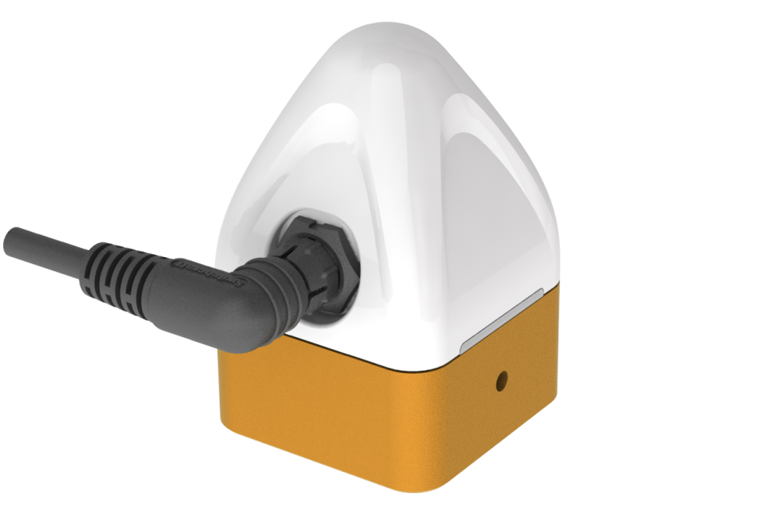

# SNOdar Snow Depth Sensor by SensorLogic, Inc in Bozeman, MT

<p align="center">
  
</p>

## Product Overview

SensorLogic's new SNOdar sensor, is used for accurately and robustly monitoring snow depth and new snowfall in remote sensing applications. Low Cost -> Low Power.

SNOdar measures snow depth, seasonal accumulation and snowfall. Simultaneously, it can relay data over a serial RS-232 or SDI-12 bus to commercially available telemetry, i.e. Satcom, modem of choice, or data logger. Furthermore, it can record an entire season of data on its internal, nonvolatile data logger so there is no need to pair every sensor with a commercial data logger;therefore, a large cost savings upon deployment.

**Purchase Sensor [HERE](https://sensorlogic.store/collections/snow-science-instrumentation/products/snodar-snow-depth-sensor)**

**Android App** 

[](https://play.google.com/store/apps/details?id=com.snodar)

<p align="center">
  
</p>

The sensor is small and lightweight, yet durable enough to monitor snow depth all season long at -40 C and colder. The unit is typically powered from a 12 VDC (as low as 6V and as high as 24V) source and consumes less than 0.5 W on average. A small battery and solar panel is all that is needed for seasonal deployment. The unit can be set up to operate as a distance sensor, storm-board snow fall sensor, or a seasonal snow depth sensor that measures settlement. A powerful mobile companion App allows the user to quickly configure and deploy the unit as well as monitor real-time
data when within Bluetooth range. As a storm-board sensor, view or download the latest storm snow total, wipe the board, and re-calibrate for the next snow fall event. Alternatively, set up the sensor as a data logger, within minutes of deployment, and return periodically to download the latest data and instantly upload the data to a cloud server for viewing, management, or analysis.

## Applications

- SNOTEL snow monitoring
- Stormboard snow measurement
- Avalanche monitoring and forecasting
- DOT road conditions monitoring
- General snow management
- Ski resort snow monitoring

## Features

- Real-time, accurate snow depth information during storms and heavy snowfall (NO postprocessing necessary)
- Bluetooth Low Energy (BLE) enabled configuration, installation, and live display
- Seasonal internal data logger
- Seasonal snow depth and new snowfall, even during heavy snowfall
- Seasonal snowfall
- Model-based Snow Water Equivalent (SWE) (*upgrade)
- SDI-12 data logger connection with commercially available devices
- RS-232 Satcom connection with commercially available devices
- Sensor orientation monitoring (e.g. high snow load, high wind, tower shifting)
- Oblique or normal angle mounting on tower
- Low power deployment $\leq$ 500 mW average consumption

## Specs

| Parameter             | Sub-Parameter Description                                                      | Min      | Max      | Units         |
| --------------------- | ------------------------------------------------------------------------------ | -------- | -------- | ------------- |
| Input Voltage         |                                                                                | 6        | 24       | volts         |
| Operating Temperature |                                                                                | -40      | 60       | $$^{\circ}$$C |
| Storage Temperature   |                                                                                | -40      | 85       | $$^{\circ}$$C |
| Mechanical Vibration  | Mil-STD-883D, Method 2007.2, 20 to 2000 Hz                                     |          | 20       | G             |
| Mechanical Shock      | Mil-STD-883D, Method 2002.3, 1 msec, 1/2 sine, mounted                         |          | 500      | G             |
| Ingress Protection    | Dust tight. Immersion, up to 1 meter (3 ft 3 in) depth                         | IP67     |          |               |
| Corrosion Resistance  | MIL-A-8625, Hard-anodizing process                                             | Type III |          |               |
|                       |                                                                                |          |          |               |
| Accuracy              | Typical deviation from absolute depth                                          | $$\pm$$1 | $$\pm$$2 | cm            |
| Resolution            | Minimum detectable depth change                                                | 0.2      | 0.5      | cm            |
| Range                 | Distance from snow target                                                      | 0.10     | 10       | meters        |
| Measurement Interval  | 1 minute granularity                                                           | 1        | 60       | mins          |
|                       |                                                                                |          |          |               |
| Current Consumption   | @ 12 VDC, with Heater ON                                                       | 0.250    | 0.260    | amps          |
| Current Consumption   | @ 12 VDC,  with Heater OFF (Idle, Active)                                      | 0.035    | 0.045    | amps          |
| Power Consumption     | Max measured with heater ON                                                    | 0.42     | 3.2      | watts         |
| Average Power         | Typical average seasonal power usage                                           | 0.5      |          | watts         |
|                       |                                                                                |          |          |               |
| Weight                | Without and with mounting clamp, respectively                                  | 265      | 375      | grams         |
| Size                  | 6.3 x 6.3 x 9.5 (W x L x H)                                                    |          |          | cm            |
| Obliqueness           | From vertical, angle slant relative to measuring surface (RMSE ~3 cm @ 40 deg) | 0        | 30       | degrees       |

## Folder Structure
```
├── user_guides
│   ├── health_app.md                   # Documentation about the SLMX4 Health App
│   └── insecure_fw_update.md           # Documentation about updating the SLMX4 Firmware
├── images                              # Contains the images used in the markdown files
├── sdi12_info
│   ├── timer_test.m                    # MATLAB Script to demo fixed radar framerate
│   ├── unit_test.m                     # MATLAB Script to verify the communication with the radar
│   ├── vcom_test.m                     # MATLAB Script to verify the ability to receive radar data
│   └── vcom_xep_radar_connector.m      # MATLAB Class to connect the Module to MATLAB
├── data_sheet
│   ├── slmx4_health.md                 # Health Firmware Protocol Buffer Details
│   ├── slmx4_usb_vcom.options          # Health Firmware Protocol Buffer .options file
│   └── slmx4_usb_vcom.proto            # Health Firmware Protocol Buffer .proto file
├── other
│   └── vcom_xep_matlab_server          # MATLAB XEP server firmware for the SLMX4
└── other
    └── inf/                            # Contains the USB VCOM device driver for Windows 
```