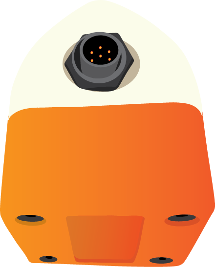

# SNOdar Snow Depth Sensor by SensorLogic, Inc from Bozeman, MT
<p align="center">
  
</p>

## Product Overview: Available for Purchase [HERE](https://sensorlogic.store/collections/snow-science-instrumentation/products/snodar-snow-depth-sensor)
SensorLogic's new SNOdar sensor is used for accurately and robustly monitoring snow depth and new snowfall in remote sensing applications, even during winter storm events.

<p align="center">
<b>Accuracy + Low Power + Low Cost!</b>
</p>

SNOdar measures seasonal snow depth and snowfall. Simultaneously, it can relay data over a serial RS-232 or SDI-12 bus to commercially available telemetry, i.e. Satcom, data logger, or cell modem. Moreover, it can record an entire season of data on its internal, nonvolatile data logger so there is no need to pair every sensor with a separate data logger;therefore, a large cost savings upon deployment.

The sensor is small and lightweight, yet durable enough to monitor snow depth all season long at -40 degC and colder. The unit is typically powered from +12 VDC (as low as +6V and as high as +24V) source and on average consumes less than 0.5 Watt. A small battery and solar panel (e.g. 50Ah + 10W) is all that is needed for seasonal deployment, depending on lattitude. The unit can be set up to operate as a distance sensor, stormboard snowfall sensor, or a seasonal snow depth sensor. A powerful mobile App allows the user to quickly configure and deploy the unit as well as monitor real-time data when within Bluetooth range. As a stormboard sensor, view or download the latest storm snow total, wipe the board, and re-calibrate for the next snowfall event. Furthermore, within minutes of deployment set up the unit as a standalone depth/snowfall sensor and data logger. Return periodically with an App-enable mobile device to download the latest data and instantly upload the data to a cloud platform, of your choice, for viewing, management, or analysis.

<p align="center">
  
</p>

Play Store App                                                                                  |  iOS App Coming Soon!
:----------------------------------------------------------------------------------------------:|:----------------------------------------------------------------------------------:
[](https://play.google.com/store/apps/details?id=com.snodar)   | [](https://www.apple.com/app-store/)

## Applications
- SNOTEL Snow Depth Monitoring
- Stormboard Snowfall Measurement
- Avalanche Monitoring and Forecasting
- DOT Road Conditions Monitoring
- Ski Resort Snow Monitoring
- Cornice Growth
- General Snow Management

## Features
- Real-time, accurate snow depth information during storms and heavy snowfall (NO postprocessing necessary)
- Bluetooth Low Energy (BLE) enabled configuration, installation, and live display
- Seasonal internal data logger
- Seasonal snow depth and new snowfall, even during heavy snowfall
- Seasonal snowfall totals
- Model-based Snow Water Equivalent (SWE) (*upgrade, coming soon!)
- SDI-12 data logger connectivity with commercially available devices (e.g. CSI CR6)
- RS-232 Satcom connectivity with commercially available devices (e.g. Rockblock Iridium)
- Sensor orientation monitoring (e.g. high snow load, high wind, tower shifting)
- Normal or oblique angle mounting (up to 30 degrees) for flexible mounting locations on inclines or stormboards
- Low power deployment, $\leq$ 500 mW average consumption

## Specifications
| Parameter             | Sub-Parameter Description                                                      | Min      | Max      | Units         |
| --------------------- | ------------------------------------------------------------------------------ | -------- | -------- | ------------- |
| Input Voltage         | Input voltage range (VDC)                                                      | 6        | 24       | volts         |
| Operating Temperature | Outside, ambient operating temperature range                                   | -40      | 60       | deg C         |
| Storage Temperature   | Inside, ambient storage temperature range                                      | -40      | 85       | deg C         |
| Mechanical Vibration  | Mil-STD-883D, Method 2007.2, 20 to 2000 Hz                                     |          | 20       | g             |
| Mechanical Shock      | Mil-STD-883D, Method 2002.3, 1 msec, 1/2 sine, mounted                         |          | 500      | g             |
| Ingress Protection    | Dust tight. Immersion, up to 1 meter depth                                     | IP67     |          |               |
| Corrosion Resistance  | MIL-A-8625, Hard-anodizing process                                             | Type III |          |               |
|                       |                                                                                |          |          |               |
| Accuracy              | Typical deviation from absolute depth                                          | +- 1     | +- 2     | cm            |
| Resolution            | Minimum detectable depth change                                                | 0.3      | 1        | cm            |
| Range                 | Distance from snow target                                                      | 0.09     | 9        | meters        |
| Measurement Interval  | 1 minute granularity                                                           | 1        | 60       | minutes       |
|                       |                                                                                |          |          |               |
| Current Consumption   | @ 12 VDC, with Heater ON                                                       | 0.250    | 0.260    | amps          |
| Current Consumption   | @ 12 VDC, with Heater OFF (Idle, Active)                                       | 0.035    | 0.045    | amps          |
| Power Consumption     | Max measured with heater ON                                                    | 0.42     | 3.2      | watts         |
| Average Power         | Typical average seasonal power usage                                           | 0.5      |          | watts         |
|                       |                                                                                |          |          |               |
| Weight                | Without and with mounting clamp, respectively                                  | 265      | 375      | grams         |
| Size                  | 6.3 x 6.3 x 9.5 (W x L x H)                                                    |          |          | cm            |
| Obliqueness           | From vertical, angle slant relative to measuring surface                       | -30      | 30       | degrees       |

## Quick Links
- [User Guides](user_guides)
- [SDI-12 Info](sdi12_info)
- [Data Sheet PDF](data_sheet/SNOdar_Data_Sheet.pdf)
- [Latest Firmware Release](https://github.com/SensorLogicInc/snodar-releases/releases)

## Folder Structure
```
├── user_guides
│   ├── README.md                       # Quick Start Guide on the SNOdar sensor and setup via the mobile App
│   └── images                          # Contains the images for this markdown file
├── sdi12_info
│   ├── README.md                       # Basic information on the SDI-12 interface and data
│   ├── 1_minute_9_values.CR1X          # Logger program for CR1000X data loggers
│   ├── 1_minute_9_values.cr6           # Logger program for CR6 data loggers
├── data_sheet
│   ├── SNOdar_Data_Sheet.pdf           # Main PDF data sheet
├── images                              # Contains the images used in the top level markdown file
```

