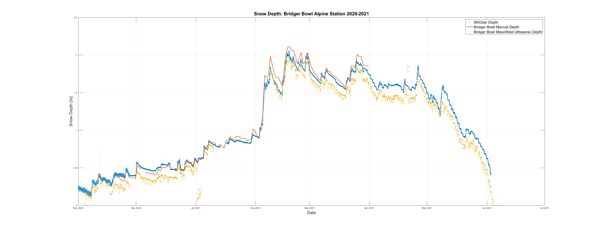

# SNOdar Field Data Water Year 2021

SLI deployed 3 major SNOdar test sites in Water Year 2021 for initial field trials. 
THe SNOdar shows high accuracy and correlation to adjacent SNOTEL monitoring sites, repeatability, and especially reliablility during heavy snowfall. 
We were able to capture the majority of the season, as well as the meltout in the spring.

1. Banner Summit Idaho

2. Bogus Basin Idaho

3. Bridger Bowl Montana
