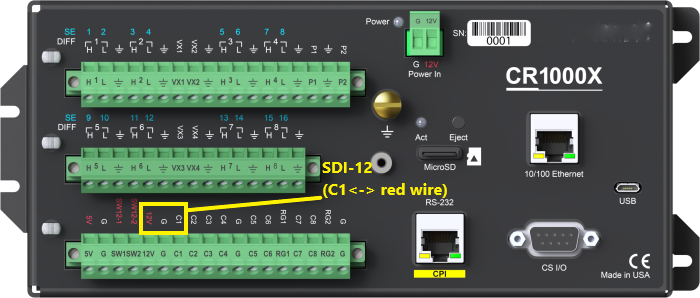
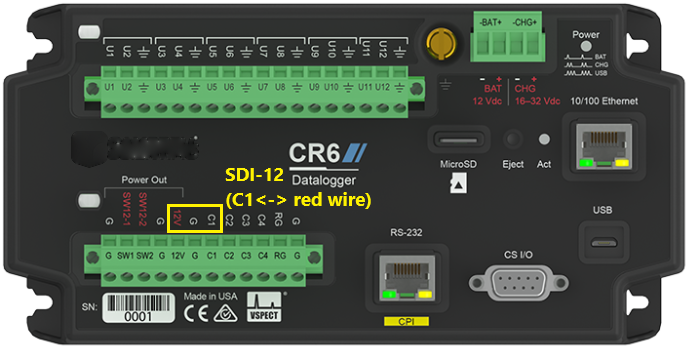

# SDI-12 Information

[Back](./)

## Data Logger

SNOdar was developed against a [CR1000X Campbell Scientific Data Logger](https://www.campbellsci.com/cr1000x). 

- The program [1_minute_9_values.CR1X](1_minute_9_values.CR1X) was downloaded to the CR1000x data logger to log from the SNOdar using SDI-12.
- The program [1_minute_9_values.cr6](1_minute_9_values.cr6) was downloaded to the CR6 data logger to log from the SNOdar using SDI-12.

Both programs include variable names and units. They were created with the program [Short Cut](https://www.campbellsci.com/shortcut)

## Data

The 9 ordered values supplied over SDI-12 by the SNOdar in order are as follows:

```
// Sensor Data
1. System Current (mA)
2. System Voltage (V)
3. Internal Temperature (degs C)
4. Orientation Flag (0 = normal, roll = bit 2, pitch = bit 1, yaw = bit 0)
5. Distance (meters)

// DSP Data
6. Seasonal Snow Depth
7. Seasonal Snowfall
8. Daily New Snowfall
9. Day-of-Year SWE
```
## Commands

SNOdar is sensitive to two standard SDI-12 Commands issued to SDI-12 address 0. The supplied CR1X program causes the CR1000X to use these two SDI-12 commands to pull data from the SNOdar. 
```
0M!
```
followed by Send Data Commands.
```
0D<n>!
```
Where:
```
n: Increasing integer value starting with 0. Send Data Command is issued until all 9 pieces of ASCII data are received. 
```

The above mentioned 9 pieces of ASCII data will be returned on the SDI-12 line. The data will come back in multiple responses to incrementing Send Data Commands. The values are broken up into 35 max character responses, where individuals records are not split between responses.

If the sensor is set up in `Manual` mode, the SDI-12 data logger actually initiates a measurement using the following command:
```
0M!
```
This will return a time delay, in seconds, that the logger needs to wait to then request the data using Send Data Commands:
```
0D<n>!
```

To query if the sensor is active and responsive, use the following command and format:
```
<a>!
```
Where:
```
a: sensor address, e.g. 0
!: terminates the command
```

## Wired Connection

| SNOdar Pin Name | SNOdar Pin NO. | Cable Pin NO. |  Wire Color |
| --------------- | -------------- | ------------- | ----------- |
| GND             | 1              | 1             | BLACK       |
| PWR +12V        | 2              | 2             | WHITE       |
| SDI-12          | 4              | 4             | RED         |

- Connection diagram for the CR1000X



- Connection diagram for the CR6


