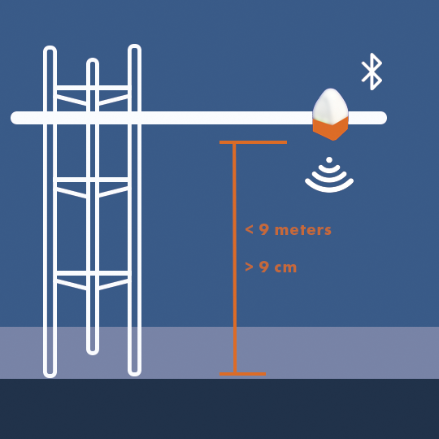
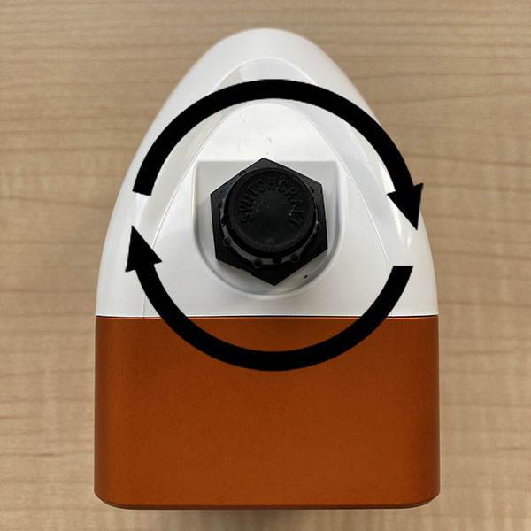
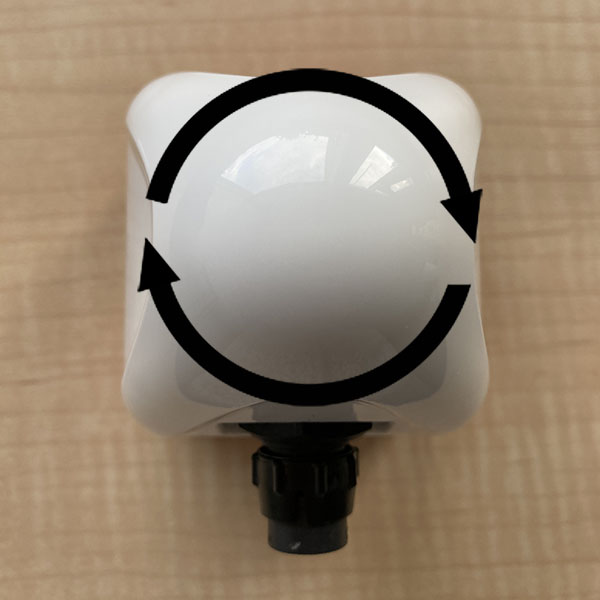
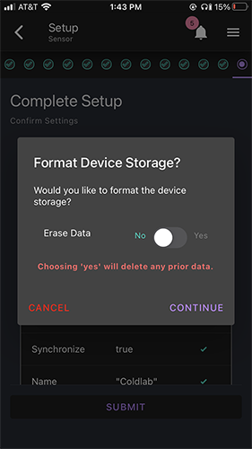
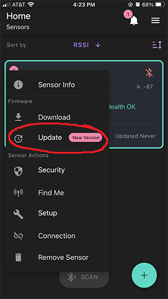
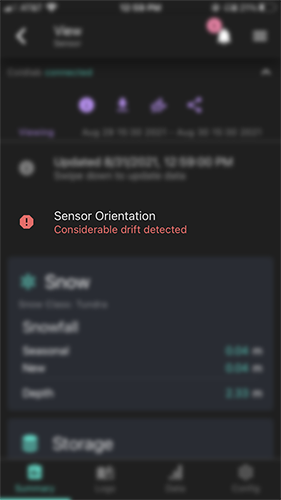

# SNOdar Quick Start Guide

## Power and Boot Sensor

1. Unbox and attach the 6-pin power cable to the main connector. The connection is directionally keyed. Make sure to engage the bayonet locking mechanism. 

2. Supply 6-24 VDC (3.5 Watt supply minimum) to the cable leads according to the pinout below (either GND can be used):

| SNOdar Pin Name | SNOdar Pin NO. | Cable Pin NO. |  Wire Color |
| --------------- | -------------- | ------------- | ----------- |
| GND             | 1              | 1             | BLACK       |
| PWR +12V        | 2              | 2             | WHITE       |
| GND             | 3              | 3             | GREEN       |
| SDI-12          | 4              | 4             | RED         |
| TX: RS-232      | 5              | 5             | BLUE        |
| RX: RS-232      | 6              | 6             | VIOLET      |

3. Once powered, look for flashing Green LEDs (20 flashes @ 5 Hz) to indicate _Good Health_ and Bluetooth Low Energy (BLE) advertisement.
4. If in the field go to [Installation and Mounting](#installation-and-mounting) directly below; otherwise, set sensor aside and set up the [SNOdar Mobile App](#download-the-app) on your mobile device.

## Installation and Mounting

### Mounting Height
Mount the sensor less than 9 meters from the ground and more than 9 cm from the ground or Stormboard fixuture.

### Obliqueness
For best performance, rotationally mount the sensor so that it is normal to the ground, i.e. measuring perpendicular to the ground surface; however, it does have the ability to be mounted at angles or on hillsides, up to 30 degrees from normal.

#### IMU Directionality
- **Roll**: Rrotation about the axis running through the clamp mount (this is the rotation monitored in **Stormboard** mode, 20 degrees is ideal)
- **Pitch**: Rotation about the axis running through the connector
- **Yaw**: Rotation about the axis running through the top dome peak

Roll                         |  Pitch                         | Yaw
:---------------------------:|:------------------------------:|:----------------------------:
  |    | 

### Ground Preparation
Before **Setup** and **Calibration**, clear the ground of any debris, e.g. sticks, rocks, or uneven ground clumps, below the sensor. Also, remove and clear large foliage and tall grass below and around the sensor. Ideally, a level dirt pad is prepared below the sensor for the most accurate seasonal measurements.

## Download the App
Depending on your mobile device of choice:

Play Store App                                                                                  |  iOS App Store
:----------------------------------------------------------------------------------------------:|:----------------------------------------------------------------------------------:
   | 

## Run the App

### Permissions
To run the fully featured App, Bluetooth and Location services (i.e. GPS) *MUST* be enabled.

### Scan
To scan for available sensors either press the **Scan** button on the bottom of the home screen. Scanning can be stopped by tapping the **Stop Scanning** button.

### Connect
1. To connect to a sensor, tap the **+** sign in the lower right corner of the screen.

2. From the **Add Sensor** screen, connect to the desired sensor by tapping on the **Connect** button by the sensor’s name.

3. When prompted, enter the default passkey `123456` and tap the pair button. 
	- For more information on changing an already connected sensor’s passkey see Security -> Change Passkey.
	
4. Devices that have already been added will be listed on the home screen and can be connected to using the **Connect** button to the right of the device's name.

### Pairing and Bonding Security
The mobile device will now have to pair and bond to the SNOdar device. This is an encryption-based security feature to protect the device and its data from nefarious and/or unintentional actions. Therefore, it is highly important to _Change_ the default passkey and note, somewhere safe, where it can be recalled if forgotten.

### Change Passkey

1. From the home screen, tap on the **Kebab Menu**  beside the name of the desired sensor.
2. Select **Security** from the menu items.
3. Tap the edit button and change the default passkey to a six digit, numeric passkey of your choice.
3. Tap the **Save** button to update the passkey.
	- NOTE: updating the passkey will restart the device

## Sensor Setup
Upon SNOdar sensor field installation, it is imperative to run the **Sensor Setup** located in the **Kebab Menu** on the home screen.

### Mounting: Orientation
The Mounting Orientation page verifies that the sensor is mounted in the proper orientation - less than 10 meters above ground and with the sensor bottom facing towards the ground.

Once the sensor has been mounted press the **verify** button in the bottom middle of the screen. If the sensor is properly oriented, the **verify** button will turn green and say **verified**.

### Mounting: Snow Presence
The Snow Presence Page records if snow is present when sensor is set up. If snow is present, the depth of the snow in meters must be entered.

### Mounting: Sensor Calibration
The Sensor Calibration Page allows the sensor to calibrate. To do so clear any obstruction from near the sensor, press the **refresh**  icon, and stand at least 10 meters away from the sensor.

### Location
The Location Page uses your mobile device's GPS to determine the sensor's location. To do so, press the **Auto Coordinates** button in the bottom middle of the screen.

The location can be updated by tapping the **Auto Coordinates** button again.

### Synchronize
The Synchronize Page synchronizes the sensor's time with the time of your mobile device. To do so, press the **refresh** icon. 

When the time has been synchronized, the newly set time will be displayed.

### Name Sensor
The Name Sensor Page allows for the sensor to be given a unique name.

The name can be reverted back to the original sensor name by pressing the **refresh** icon to the right of the text input field.

### Sensor Mode
The Sensor Mode Page allows for different sensor operation modes to be selected.

- The **Snow Depth** sensor mode is standard automated snow depth measurement. The unit needs to be calibrated at the beginning of each season (preferably when NO snow is present) for accurate, settled snow depth measurements.
- The **Stormboard** sensor mode is a manual calibration mode for storm snowfall measurements. This mode will calibrate to 'zero' accumulation after the user wipes the stormboard clean of snow. A manual calibrate after each clear will help the accuracy remain high.
- The **Distance** sensor mode is used for basic distance measurements. This will be the default mode when NO Bluetooth setup can be done. The sensor will measure distance to the snow every 5 minutes and send data out the SDI-12.
- The **Manual** sensor mode has no automated operation only user interactions. This mode is used exclusively for testing and in lab scenarios.

### Snow Class
The Snow Class Page allows for the type of snow to be specified. Choose a snow class out of alpine, maritime, prairie, tundra, and taiga that best describes the snow in your location.

### Measurement Interval
The Measurement Interval Page allows for the interval at which measurements are taken to be set.

To set the interval, tap anywhere on the current hours and minutes listing. Then tap the time button that appears. To increase the time, drag the hours (left) or minutes (right) up. To decrease the time, drag the hours (left) or minutes (right) down. Tap anywhere outside of the time input to exit.

### Logging
The logging mode for data acquisition can be set to a combination of internal logging, RS232, and SDI-12.

### Complete Setup
Lastly, the Complete Setup Page provides a summary of the settings. To confirm the settings and complete the sensor setup, press submit. To correct a setting, page back through the previous pages using the completion bar at the top of the screen.

### Erase Data Flash
Before sensor setup is complete you will be asked if you would like to format the device storage. By choosing yes the device storage will be formatted *and any prior data of the sensor will be deleted*. By choosing no, the device storage will not be formatted and the sensor's prior data will be preserved. 

## View
To view a sensor and its associated data, press the **View**’ button on the desired sensor’s tab. Return to the home page using the back arrow in the top left corner, or navigate through each of the sensor’s pages for required functionality (listed below).

### Summary 
The Summary Page provides an overview of the sensor's data as well as displays any errors with the sensor. For more information on sensor error notifications see the Sensor Error Notifications section of the user guide.
The Summary Page contains information on snow depth, sensor storage, measurement information, sensor power, internal sensor temperature including potential heater failure, and sensor orientation including potential sensor drift.  

### Logs
The Logs Page displays data that has been downloaded for the sensor. To download data, press the **Download** icon on the toolbar for the Logs page. You will be prompted to choose data from either the last day, the last week, or the last month. A custom range can also be selected by tapping first on the displayed date or time and then editing that date or time in the input field below.

Once downloaded, the log can be deleted, viewed, or shared. Tapping the **View** button will take you to the Data Page. You can also view the log info by tapping on the **i SNOLOG** icon. 

### Data
The Data Page displays an interactive depiction of the downloaded data. Tapping the **Dropdown menu** above the chart will display the different collections of data that can be displayed. The chart settings can also be altered by tapping the **Settings** icon beside the dropdown menu. 

### Config
The Config Page allows for quick edits of some of the sensor's settings. These settings can only be edited after the **unlock** button in the bottom corner of the screen is tapped. The **lock** button should be tapped after edits are made. 

## Appendix

### Device Firmware Update (DFU)

The App has the ability to update the sensor firmware over-the-air (OTA). Toggle the main _Kebab_ menu in the upper left corner of the sensor card on the _Home_ page. If there is an available update, a red-encircled `+` alert will appear by the _Update_ action. Initiate the update and the unit LEDs will quickly flash Magenta, then hold Cyan while it is updating. DON'T power down the sensor or quit the App while updating. The unit will reboot and flash Green when updated and ready.

Sensor Card Kebab Menu Location         |  Available Firmware Update
:--------------------------------------:|:------------------------------------------------:
            | 

### LED Legend

- Upon Boot
	- 4 secs @ 5 Hz Green: Health Diagnostis **Passing**
	- 4 secs @ 5 Hz Red: Health Diagnostics **Failure**
- Measurement
	- Solid Yellow for length of measurement
	- Solid White for length of calibration
- BLE Connect
	- Fad Blue -> Cyan -> White for 2 seconds
- BLE Disconnect
	- Fad White -> Cyan -> Blue for 2 seconds
- Device Firmware Update (DFU) via Mobile device
	- Magenta for 2 seconds preparing update into Cyan for the length of the upload, up to 60 seconds. The unit will reboot when updating is finished.
- `Find Me` Feature on the _Home_ Kebab menu
	 - Blue <-> White ping-pong for 4 seconds
	 - Useful to identify units when there are multiple sensors to configure

### Sensor Error Notifications

- Orientation Drift (on the left): This sensor orientation notification will appear if considerable drift has been detected in the sensor's orientation. This error can be resolved by adjusting the sensor back to the correct orientation.
- Heater Failure (on the right): This notification will be seen if the sensor's internal heater fails.

Orientation Drift Notification                      |  Heater Failure Notification
:--------------------------------------------------:|:------------------------------------------------:
 |  

### Understanding the Menus

- Menu Legend

- General App Info is contained in the upper right Hamburger Menu.

Main App Hamburger Menu Location              |  Main App General Info
:--------------------------------------------:|:------------------------------------------------:
   |  
