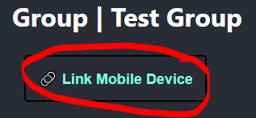
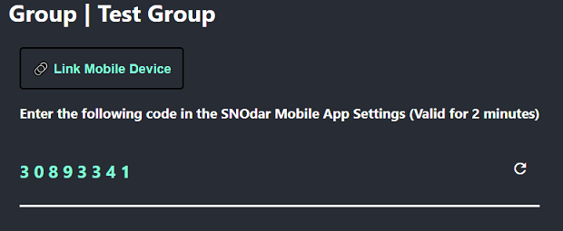

# SNOdar Chairlift Gateway ([SNOCHGW](https://sensorlogic.ai/sensor-products/SNOdar-Chairlift-Gateway)) + SNOdar Cloud Connection Guide

[Back](../)

> ### **Purchase on our web shop: [SNOdar + Chairlift Gateway Bundle](https://sensorlogic.store/collections/snow-science-instrumentation/products/snodar-chairlift-gateway?variant=42569883025563)**

## Dependencies

- SNOdar Firmware: [snodar-v0.8.0](https://github.com/SensorLogicInc/snodar-releases/releases/tag/0.8.0-beta) or later (see [SNOdar DFU](https://www.youtube.com/embed/v8IoPYJle9w) to first update the SNOdar's firmware)
- Mobile App: `SNOdar Snow Depth v0.4.6` or later (update this in your mobile app store of choice)

Google Play Store App                                                                                  |  iOS App Store
:----------------------------------------------------------------------------------------------:|:----------------------------------------------------------------------------------:
   | 

## Hardware Setup

### __Power and Boot Gateway__

-1. Unbox and attach the 6-pin power cable to the main connector. The connection is directionally keyed. Make sure to engage the bayonet locking mechanism. 

Chairlift Gateway            |  Power Connection                     
:---------------------------:|:------------------------------:
      |    

-2. Supply 6-24 VDC (0.5W supply minimum is needed to support the LTE-M backhaul) to the cable leads according to the pinout below:

| SNOCHGW Pin Name| SNOCHGW Pin NO.| Cable Pin NO. |  Wire Color |
| --------------- | -------------- | ------------- | ----------- |
| GND             | 1              | 1             | BLACK       |
| PWR +12V        | 2              | 2             | WHITE       |
| GND             | 3              | 3             | GREEN       |
| (RES)           | 4              | 4             | RED         |
| (RES)           | 5              | 5             | BLUE        |
| (RES)           | 6              | 6             | VIOLET      |

> Note: **15 Watt** capable, or less, max power supply is required. When on battery supply, an inline fuse **MUST** be located close to the battery that limits the battery supply to 15W or less. For example:
- @ 12Vdc use a 1A fuse
- @ 24Vdc use a 0.5A fuse

### __Connect Gateway to SNOdar__
 
-1. Once powered, both LEDs will be __RED__ upon boot. 

> Note: If the SNOdar has already been [Provisioned](#snodar-provisioning), see below, The left LED (Bluetooth/BLE Indicator) will turn __Blue__ once it connects to a valid SNOdar, with the greatest RSSI, via Bluetooth and the right LED (LTE-M/LoRa Indicator) will turn __Green__ once it successfully connects to the LTE network in range.

-2. Make sure the Gateway is in `Good` Bluetooth signal range of the SNOdar, &le; 20 meters.

-3. Mount the Gateway on the SNOdar tower with [U-Bolts](https://www.mcmaster.com/u-bolts/center-to-center~1-1-2/thread-size~1-4-20/) or heavy-duty UV-resistant [Zipties](https://www.mcmaster.com/cable-ties/uv-protection~uv-resistant/width~0-23/width~0-22/width~0-2/width~0-19/minimum-temperature~-75-f/minimum-temperature~-65-f/minimum-temperature~-50-f/minimum-temperature~-40-f/). Typically, this can be below the SNOdar unit ~1 meter off the ground, depending on cell coverage. Unit(s) should be located outside for proper cell connectivity.

> Note: The Bluetooth (BLE) LED will be solid __Blue__ and LTE LED will be solid __Green__ when everything is connected and operational. 

## SNOdar Provisioning

### __Dashboard Setup__

-1. Provisioning the SNOdar with the [snodar.io](https://app.snodar.io/groups/) Cloud Service using the Mobile Link can be done independently of the Gateway backhaul unit; however, it is useful to have both units powered and operational so data can be verified on the [Dashboard](https://app.snodar.io/) once the steps are completed.

-2. [`Sign In`](https://app.snodar.io/login?ref=%2F) to your account, or create a new account on the `snodar.io Dashboard`.

-3. Create a `Group` or navigate to an existing [`Group`](https://app.snodar.io/groups/) that you want to use for your SNOdar unit.

-4. Once the `Group` is created, click on the `<Group Name>`, then click `Link Mobile Device` to retrieve a provisiong code. Copy the code for later use in the [Mobile App](#mobile-app-setup).
 
Edit Group                              |  Link Mobile Device                           | Get Link Code                                        
:--------------------------------------:|:---------------------------------------------:|:---------------------------------------:
    |   |  

### __Mobile App Setup__

-1. Power the SNOdar sensor, according to the [User Guide](README.md), and start the Mobile App in your mobile device. Connect to the SNOdar unit via BLE.

-2. Navigate to the main App `Settings` menu by using the [Hamburger Menu Icon](images/hamburger_menu_location.png) in the upper right corner. Then activate the `Cloud Mobile Link` drop down and choose `+ Add a Group Code`.

-3. Type in the `Group Code` you copied from `Link Mobile Device`(Step 4 of Dashboard Setup) on the web [Dashboard](https://app.snodar.io/) and hit `Submit`.

-4. Navigate back to the Mobile App `Home` page (you should still be connected to the desired SNOdar sensor) to `Register` the specific SNOdar and `Enable` the SNOLOG cloud upload, by toggling the [Cloud](images/cloud_disable_enable.png) icon.

-5. Toggle the [Cloud](images/cloud_disable_enable.png) icon to `Register`, then toggle again to `Enable`.  The icon will turn from white (with a diagonal line) to green (with an arrow pointing up) and be enabled.

Toggle                                  |  Register                              | Toggle                                  | Enable                    
:--------------------------------------:|:--------------------------------------:|:---------------------------------------:|:--------------------------------------:
   |   |    |    

-6. Finally, the [Cloud](images/cloud_disable_enable.png) icon will display as `Enabled`, indicating the Gateway is now uploading a SNOLOG from the desired SNOdar, based on the configured `Interval Time` requested in the [Setup Wizard](https://www.youtube.com/embed/s7zSW9LP-iM).

## Troubleshooting FAQ

1. What if the LTE LED never turns __Green__?
    - Wait 5 minutes with the unit powered. The first time the LTE modem registers after being powered down for an extensive amount of time it can take awhile to re-register with the nearest tower.
    - No antenna is attached. Make sure antenna is screwed on hand tight.
    - Unit is mounted to low or being obstructed. Make sure unit is mounted at least 1 meter off the ground and has a clear view of the sky.
    - Connectivity is poor in the area.  What carriers are available? What does your cell phone show for service? Move to a different spot with better service.
2. What if the Bluetooth (BLE) LED never turns __Blue__?
    - Is the SNOdar powered?
    - Has the SNOdar been configued and setup properly via the [Setup Wizard](https://www.youtube.com/embed/s7zSW9LP-iM)?
    - Check that the Bluetooth communication is working by connecting with the Mobile app via your mobile device.
    - Has the SNOdar been registered, is the [Cloud](images/cloud_disable_enable.png) icon enabled?
3. What does it mean if the BLE LED turns __Cyan__ -> __Magenta__?  
    - The unit is performing a firmware update over-ther-air; let it finish.
4. What does it mean if the __BLUE__ BLE LED blinks rapidly?  
    - This indicates a SNOLOG is being sent to the Cloud [snodar.io Dashboard](https://app.snodar.io/)!
5. What if everything seems correct, but the SNOLOG is still not rendering on the [Dashboard](https://app.snodar.io/)?
    - Reboot the SNOdar unit by to disconnecting the power for 5 seconds, then reconnecting.
    - Reboot the SNOdar by `Restarting` the unit via the Mobile App, from the `Home` screen, using the [Kebab Menu Icon](images/snodar_home_kebab.PNG)

    

    - Toggle the [Cloud](images/cloud_disable_enable.png) icon twice, `Disable` then `Enable` again.

    
