# SNOdar + Chairlift Gateway Legacy Migration Guide

[Back](../)

> ### **Purchase on our web shop: [SNOdar + Chairlift Gateway Bundle](https://sensorlogic.store/collections/snow-science-instrumentation/products/snodar-chairlift-gateway?variant=42569883025563)**

## Brief

The premise of this document is to provide detailed instructions to migrate your SNOdar and LTE Chairlift Gateway over to the new Dashboard and Backend, [SNOfire Chairlift Dashboard](chairlift.snofire.io), from the existing Dashboard, [SNOdar Dashboard](app.snodar.io). 

New sensing metrics (e.g. Temp/Pressure/Humidity/Air Quality), lower data rates, Over-the-Air (OTA) firmware upgrades for both devices, seasonal data downloads, and new plotting and rendering are all available on the new Dashboard!

[Create an Account](https://chairlift.snofire.io/auth) on the new Dashboard and follow the instructions below. You will need to access your units in the field and use the Bluetooth (BT) mobile app to complete. The entire process should only take 10-15 minutes.

## Dependencies

- SNOdar Firmware: [snodar-v0.9.4](https://github.com/SensorLogicInc/snodar-releases/releases/tag/0.9.4-beta) to force update
- SNOdar Firmware: [snodar-v1.0.0](https://www.dropbox.com/s/lmt0zs7a14w5snn/snodar_secure_dfu_esb_v1.0.0.zip?dl=1) to migrate to new dashboard
- Mobile App: `SNOdar Snow Depth v0.4.6` or later (update this in your mobile app store of choice)

Google Play Store App                                                                                  |  iOS App Store
:----------------------------------------------------------------------------------------------:|:----------------------------------------------------------------------------------:
   | 

## Migration Instructions

> Warning:   
> Following the below steps in order is very imporant!

### 1. Natural SNOdar Firmware Update via Mobile App

a) Travel to within Bluetooth range of both the SNOdar and Gateway units ($\leq 20$ meters).

b) Connect to the SNOdar using the Mobile App.

C) Check for the latest updates and update naturally, using the FW update dropdown, to the most current cloud released firmware: [snodar-v0.9.4](https://github.com/SensorLogicInc/snodar-releases/releases/tag/0.9.4-beta)

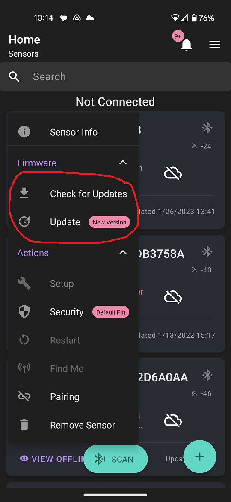

d) Once it successful updates and has rebooted, reconnect via the mobile app.

### 2. Force Gateway Firmware Update

a) Click on the white/green `Cloud Icon` and a message appears to either `Register` or `Enable`.

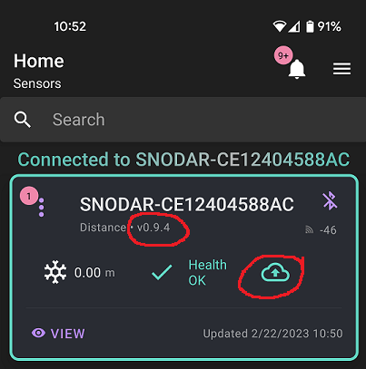

b) Click the `Register` button to force the Gateway to upgrade firmware. This will allow the Gateway to access the new server endpoint and download its latest firmware. Continue to click `Confirm` on the next page and `OK` on the Alert Page.

> Note:  
> Ignore any alerts about an "active group link key" or "Cloud Mobile Link" as this is  depricated functionality and messaging.

 Register                                    | Confirm                                     | Alert
:-------------------------------------------:|:-------------------------------------------:|:-------------------------------------------:
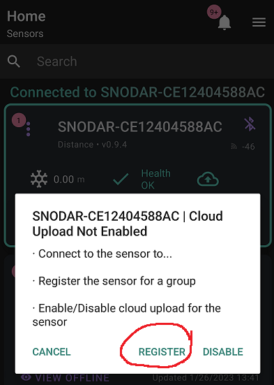  | 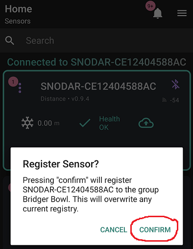  | 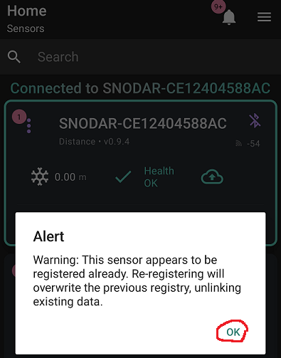

c) Watch the Gateway LEDs, as the BLE LED will breifly go Cyan then turn Magenta while it is downloading firmware. The download will take 4-8 minutes. If it is successful the unit will reboot itself, so both LEDs will turn off then come up as RED. The LTE LED should go Green in less than 30 seconds. 

d) If the unit immediately reboots after initiating this process or the LEDs both turn Yellow (Watchdog Reset), try Steps 1-3 again until it is successful.

### 3. Set Serial Number to Provision SNOdar

a) Now you must rename the SNOdar in the App to the given Serial Number on the bottom of the unit next to the QR code. The SN will be a 6-digit number with the following format: `210<xxx>`.

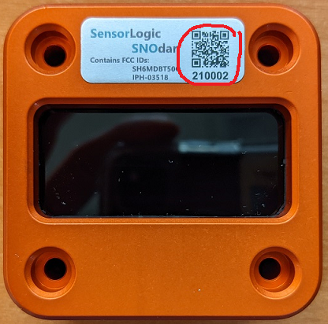

b) Again, open the specific SNOdar and navigate to the `Config` page.

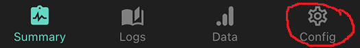

c) Choose the `Sensor` dropdown then `Name` and type in the 6-digit serial number from the bottom of the unit. Hit `Save`.

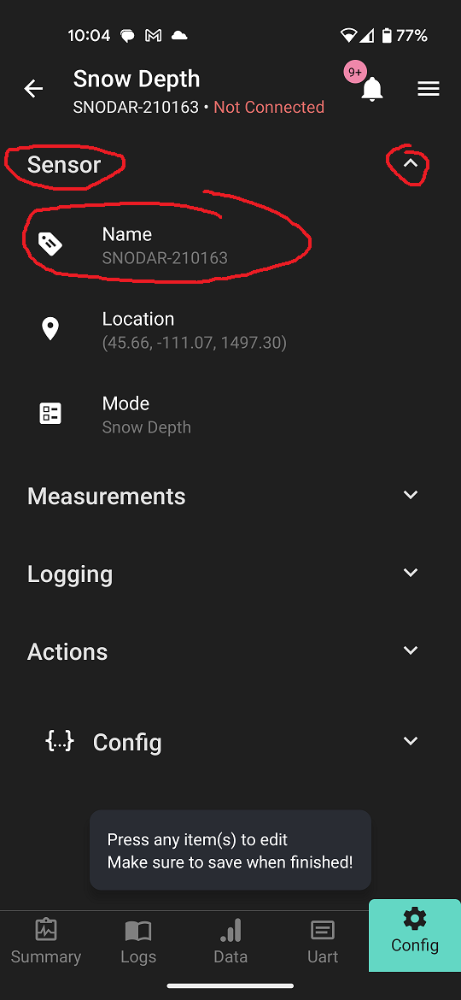

d) Reboot the unit from the mobile app.

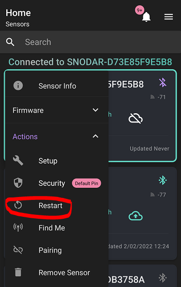

### 4. Enable _Developer_ Mode

a) Click on the main mobile app `Settings` menu in the upper right corner.

 

b) You will notice the mobile app version, `v0.4.6`, in the upper left corner. Click on this until it tells you `Developer` Mode is enabled (20+ times).

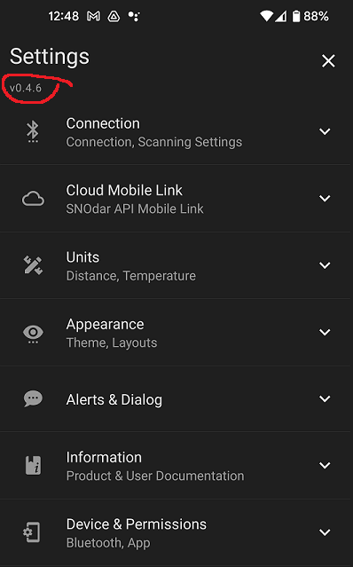

c) Go to new `{} Developer` dropdown and enable `Dev Mode` with the toggle switch.

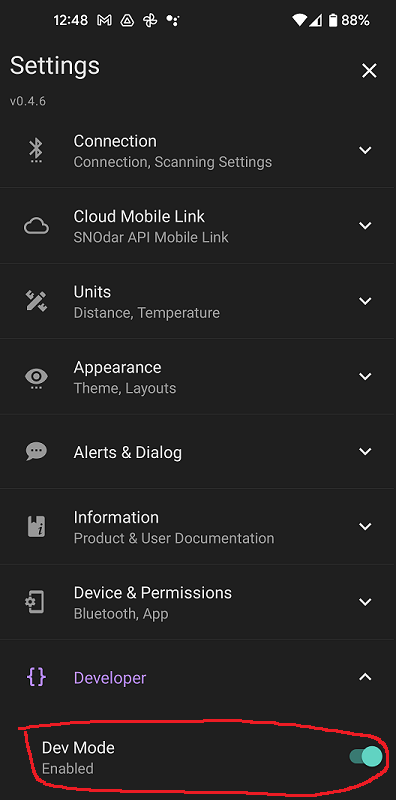

### 5. Manual SNOdar Firmware Update via Mobile App

a) Download the new SNOdar FW [snodar-v1.0.0](https://www.dropbox.com/s/lmt0zs7a14w5snn/snodar_secure_dfu_esb_v1.0.0.zip?dl=1) to your mobile device. 

> Note:      
> Some devices require you to rename the firmware file before it can be visible by the Mobile App when choosing the file

b) Start the Mobile app and connect to the SNOdar. Open the specific SNOdar and navigate to the `Config` page.

c) Under `Actions` dropdown choose `Manual Firmware Update` then choose the `<fw_name>_v1.0.0.zip` FW file you downloaded (and potentially renamed) in Step 1.

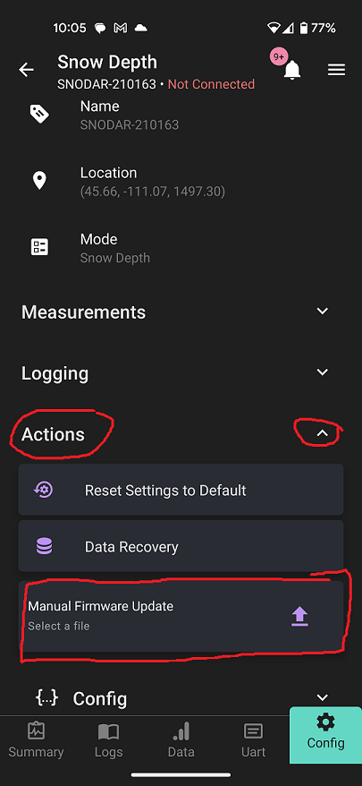

d) Let this process complete, the SNOdar will reboot and flash Green.

### 6. Set the Cloud Enable Icon to Green

a) Reconnect to the SNOdar via the mobile app and toggle the Cloud Icon button again and choose `Enable` so data will be automatically sent to the backend database.

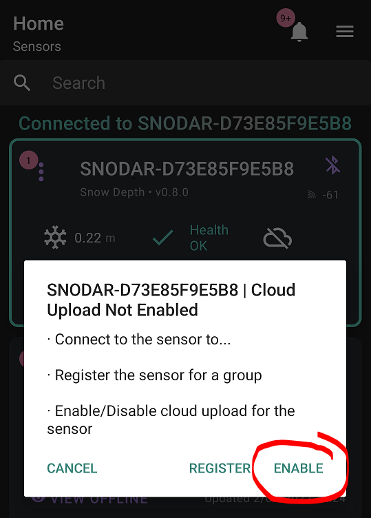

b) The Cloud Icon will turn Green.

c) Reboot the unit from the mobile app.

### 7. Claim Serial Number on new [Dashboard](chairlift.snofire.io)

a) Navigate to the [Chairlift Dashboard](chairlift.snofire.io) and log in to your account (or Create an Account)

b) Navigate to the `Legacy: Claim a SNOdar` page, see the left side nav bar.

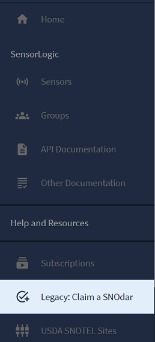

c) Enter the 6-digit Serial Number and hit `Go`.

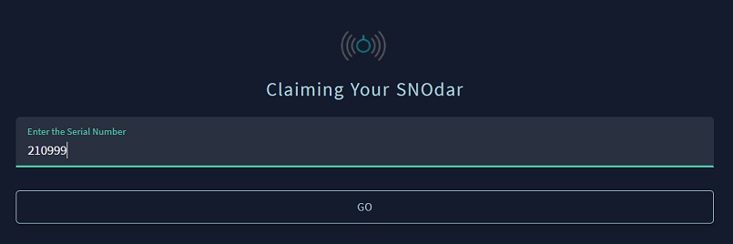

d) Your SNOdar should be claimed and viewable on the new Dashboard within 24 hours.