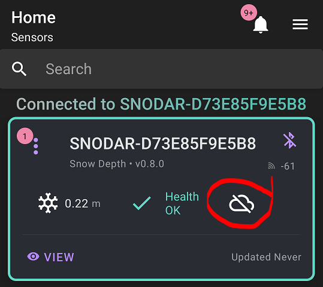

# SNOdar + Chairlift Gateway Migration Guide to [SNOfire Chairlift Dashboard](chairlift.snofire.io)

[Back](../)

> ### **Purchase on our web shop: [SNOdar + Chairlift Gateway Bundle](https://sensorlogic.store/collections/snow-science-instrumentation/products/snodar-chairlift-gateway?variant=42569883025563)**

## Dependencies

- SNOdar Firmware: [snodar-v0.9.4](https://github.com/SensorLogicInc/snodar-releases/releases/tag/0.9.4-beta) to force update
- SNOdar Firmware: [snodar-v1.0.0](https://www.dropbox.com/s/lmt0zs7a14w5snn/snodar_secure_dfu_esb_v1.0.0.zip?dl=1) to migrate to new dashboard
- Mobile App: `SNOdar Snow Depth v0.4.6` or later (update this in your mobile app store of choice)

Google Play Store App                                                                                  |  iOS App Store
:----------------------------------------------------------------------------------------------:|:----------------------------------------------------------------------------------:
   | 

## Natural SNOdar Firmware Update via Mobile App

1. Get within Bluetooth range of both the SNOdar and Gateway units ($\leq 20$ meters).
2. Connect to the SNOdar using the Mobile App
3. Check for the latest updates and update naturally, using the FW update dropdown, to the most current cloud released firmware: [snodar-v0.9.4](https://github.com/SensorLogicInc/snodar-releases/releases/tag/0.9.4-beta)

4. Once this has rebooted, reconnect via the BT mobile app and Force Gateway Firmware Update.

## Force Gateway Firmware Update

1. Click on the white `Cloud Icon` and a message appears to either `Register` or `Enable`.

2. Click the `Register` button to force the Gateway to upgrade firmware. This will allow the Gateway to access the new server endpoint and download the latest firmware.

> Note:  
> Ignore any old functionality alerts about an "active group link key" or "Cloud Mobile Link"

3. Watch the Gateway LEDs, as the BLE LED will breifly go Cyan then turn Magenta while it is downloading firmware. The download will take 4-78 minutes. If it is successful the unit will reboot itself, so both LEDs will turn off then come up as RED. The LTE LED should go Green in less than 30 seconds. 

4. If the unit immediately reboots after initiating this process or the LEDs both turn Yellow (Watchdog Reset), try Steps 1-3 again until it is successful.

5. When successfull, set the Serial Number and Cloud Enable.

### Set Serial Number to Provision SNOdar and Cloud Enable

1. You must rename the SNOdar in the App to the given Serial Number on the bottom of the unit next to the QR code. The SN will be a 6-digit number with the following format: `210<xxx>`.

2. Again, open the specific SNOdar and navigate to the `Config` page.

3. Choose the `Sensor` dropdown then `Name` and type in the 6-digit serial number from the bottom of the unit. Hit `Save`.

4. Next, toggle the Cloud Icon button again and choose `Enable` so data will be automatically send to the cloud database.

The Cloud Icon will turn Green.

5. Finally, reboot the unit, and then do a Manual SNOdar FW Update

## Manual SNOdar Firmware Update via Mobile App

1. Download the new SNOdar FW [snodar-v1.0.0](https://www.dropbox.com/s/lmt0zs7a14w5snn/snodar_secure_dfu_esb_v1.0.0.zip?dl=1) to your mobile device. 

> Note:   
> Some devices require you to rename the firmware file before it can be visible by the Mobile App

2. Start the Mobile app and connect to the SNOdar. Open the specific SNOdar and navigate to the `Config` page.

3. Under `Actions` dropdown choose `Manual Firmware Update` then choose the v1.0.0 FW file you downloaded in Step 1.

4. Let this process complete, the SNOdar will reboot and flash Green.

5. Reconnect to the SNOdar via Bluetooth with the Mobile App and Set the Serial Number.

### Claim Serial Number on new [Dashboard](chairlift.snofire.io)

1. Navigate to the [Chairlift Dashboard](chairlift.snofire.io) and log in to your account (or Create an Account)
2. Navigate to the `Legacy: Claim a SNOdar` page, see the left side nav bar.

3. Enter the 6-digit Serial Number and hit `Go`.

4. Your SNOdar should be claimed and viewable on the new Dashboard within 24 hours.

## Troubleshooting FAQ